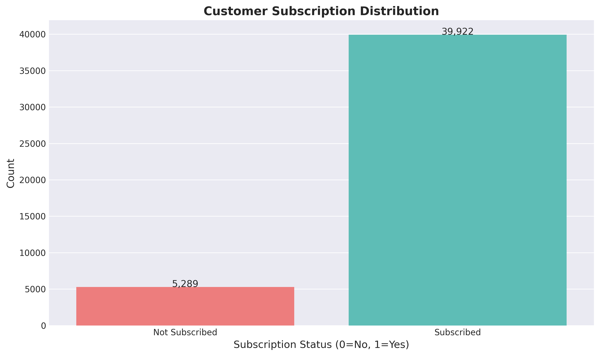
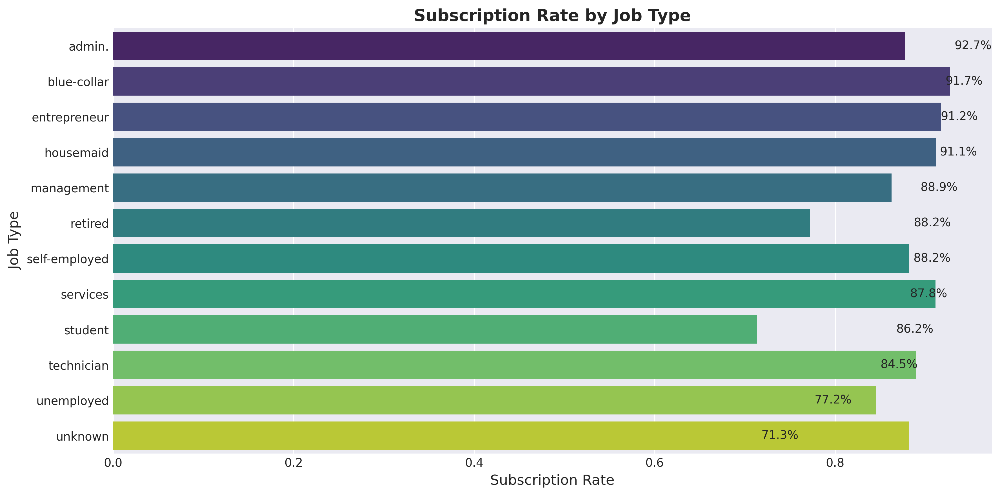
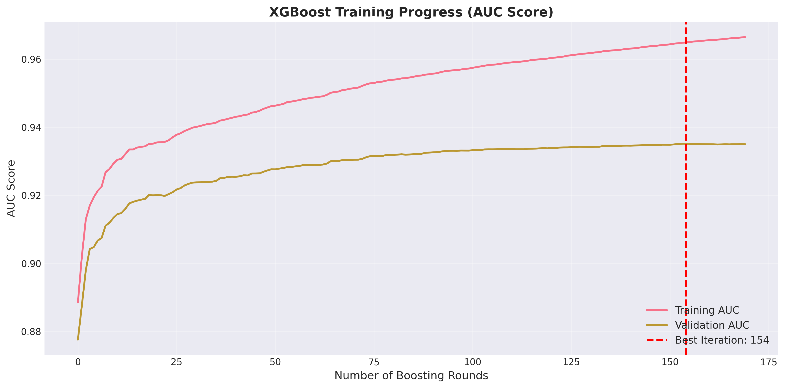
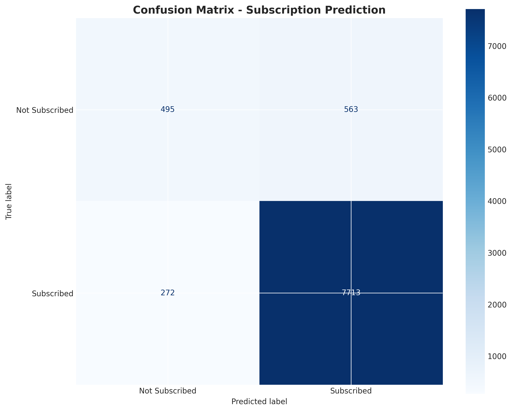
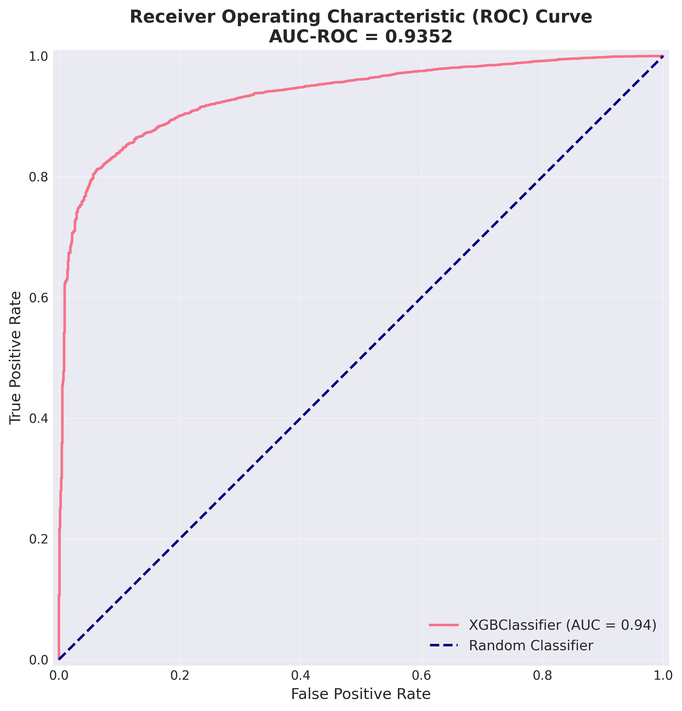
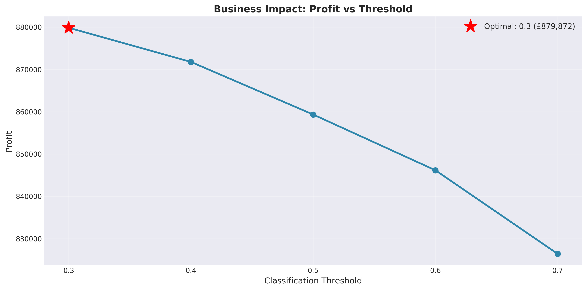
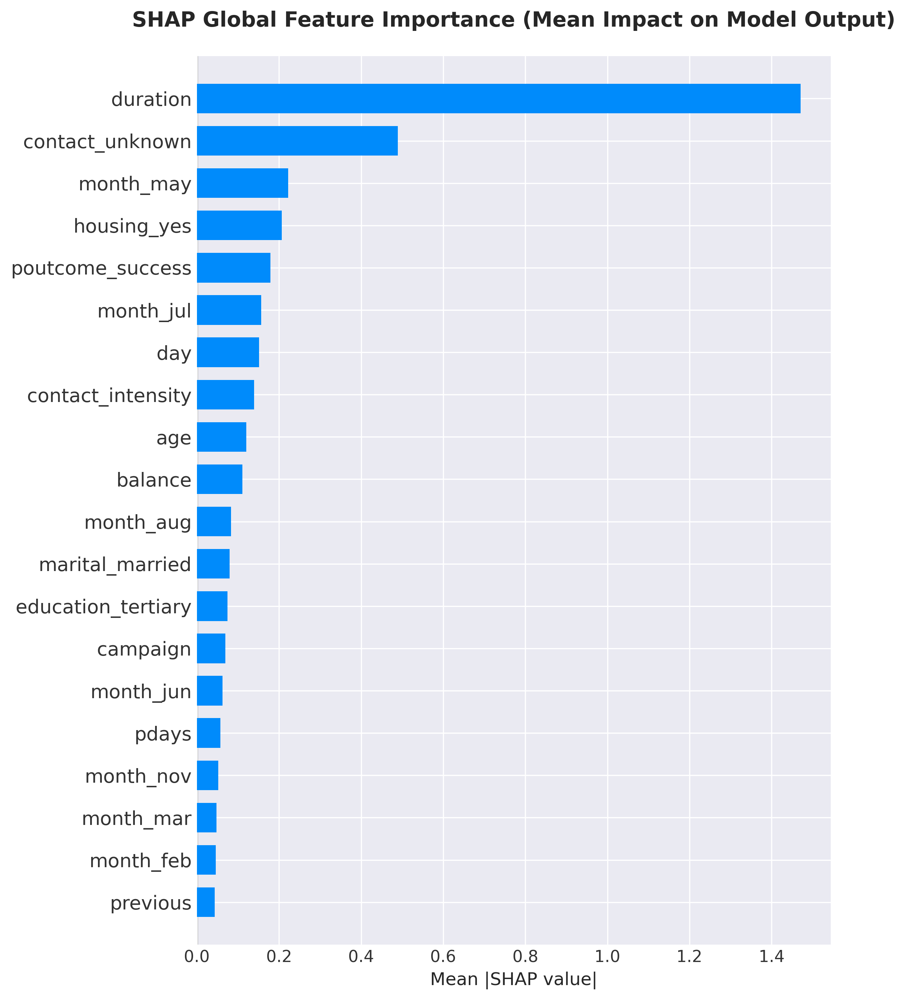
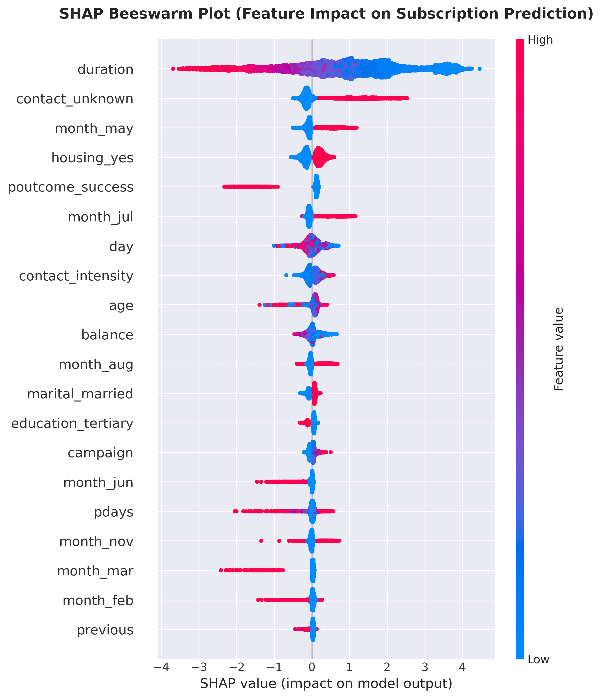

# Customer Subscription Prediction using XGBoost

Predicts customer term-deposit subscriptions from the UCI Bank Marketing dataset. Organized as a modular, reusable pipeline with a business-aware threshold analysis and SHAP explainability.

**Result:** XGBoost classifier with ROC-AUC of 0.7741 on a class-imbalanced target (11.7% subscribed). See `outputs/reports/classification_report.txt` for precision, recall, and F1 per class.

## System Architecture

The project uses a modular design with six specialized components:

```
Data Pipeline → Feature Engineering → Model Training → Evaluation → Business Analysis
     ↓               ↓                      ↓               ↓              ↓
data_preprocessing  feature_engineering   model_training  evaluation   business_metrics
     ↓               ↓                      ↓               ↓              ↓
  + Visualization layer (all modules)
```

### Module Structure

**`src/data_preprocessing.py`**
- Loads UCI Bank Marketing dataset from OpenML
- Handles missing values (median for numeric, mode for categorical)
- One-hot encoding for categorical variables
- Stratified train-test splitting
- Feature scaling with StandardScaler

**`src/feature_engineering.py`**
- Creates engineered features:
  - `contacted_before`: Binary flag for previous campaign contact
  - `contact_intensity`: Ratio of current to previous contacts

**`src/model_training.py`**
- XGBoost classifier with early stopping
- Hyperparameter management
- Prediction and probability generation
- Feature importance extraction

**`src/evaluation.py`**
- Standard classification metrics (accuracy, precision, recall, F1, AUC-ROC)
- Confusion matrix analysis
- ROC curve generation
- Threshold sensitivity analysis across decision boundaries

**`src/business_metrics.py`**
- Calculates marketing campaign costs (£/call)
- Revenue from subscriptions (£/conversion)
- Net profit optimization across thresholds
- Return on investment (ROI) analysis
- Identifies the threshold that maximizes profit under the assumed costs

> **Note:** Cost and revenue values used in the profit analysis are illustrative assumptions, not real campaign data.

**`src/visualization.py`**
- Class distribution analysis
- Training progress monitoring
- Confusion matrices and ROC curves
- Feature importance plots
- Business impact across thresholds

## Automation & Workflow

The modular design supports scripted, repeatable workflows:

```python
from src import *
from src.business_metrics import find_optimal_threshold

# Preprocessing pipeline
df = load_and_prepare_data()
numeric_cols, categorical_cols = get_column_types(df)
df = handle_missing_values(df, numeric_cols, categorical_cols)
df_encoded = encode_categorical_features(df, categorical_cols)
df_encoded = create_features(df_encoded)

# Train-evaluate-optimize pipeline
X_train, X_test, y_train, y_test = split_data(X, y)
X_train_final, X_test_final, _ = scale_features(X_train, X_test, numeric_cols)
model = train_xgboost_model(X_train_final, y_train, X_test_final, y_test)

# Business optimization
y_probs = predict_probabilities(model, X_test_final)
optimal = find_optimal_threshold(y_test, y_probs)
print(f"Optimal threshold: {optimal['optimal_threshold']}")
print(f"Expected profit: £{optimal['metrics']['profit']:,.0f}")
```

Each module can be used independently, which allows:
- Reuse in different projects
- Testing individual components in isolation
- Parameter customization
- Easier integration into larger pipelines

## Design Principles

**Separation of Concerns**
Each module handles a single responsibility, making the code easier to maintain and test.

**Reusability**
Functions are parameterized with sensible defaults, supporting notebook exploration as well as scripted use.

**Composability**
Modules chain together: output from one becomes input to the next, enabling flexible pipelines.

**Business Awareness**
The business_metrics module connects predictions to estimated business value (profit, ROI) under stated assumptions, not just model accuracy.

## Project Outputs

All analysis artifacts are generated in `outputs/` and organized by type:

### Visualizations (`outputs/figures/`)

Plots saved at 300 DPI.

**Class distribution** (11.7% subscribed)



**Subscription rate by job type**



**XGBoost training history** (AUC during training)



**Confusion matrix**



**ROC curve** (AUC: 0.7741)



**Estimated profit across thresholds**



**SHAP global feature importance**



**SHAP beeswarm** (feature impact direction)



### Reports (`outputs/reports/`)

Structured analysis artifacts:

| File | Description |
|------|-------------|
| `business_summary.md` | Summary of the estimated business impact and recommendations |
| `classification_report.txt` | Detailed classification metrics (precision, recall, F1-score per class) |
| `threshold_analysis.csv` | Threshold sensitivity analysis across 0.3–0.7 range |
| `model_metrics.json` | Model performance metrics in JSON format (accuracy, precision, recall, F1, AUC-ROC) |

All outputs are generated automatically by the notebook pipeline.

## Model Artifacts

Serialized model assets are stored in `models/`.

| Artifact | Description |
|---|---|
| `xgboost_model.pkl` | Trained XGBoost classification model |
| `preprocessor.pkl` | Serialized preprocessing artifact used before inference |
| `model_metadata.json` | Model type, evaluation summary, and training context |
| `threshold_analysis.csv` | Threshold-based business analysis for profit optimization |
| `README.md` | Artifact guide for the `models/` directory |

These files separate training from inference and make reuse straightforward.

## Features

- Feature Engineering (automated + manual)
- XGBoost Classification
- Threshold Optimization (profit-based, under assumed costs)
- SHAP Explainability
- Business Profit Analysis
- Modular, reusable components

## Tech Stack

- Python 3.8+
- Scikit-learn
- XGBoost
- Pandas / NumPy
- SHAP
- Matplotlib / Seaborn
